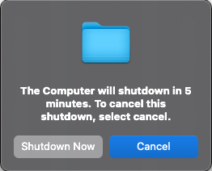

# GracefulShutdown
Set a cancelable GUI Prompt for shutdown with a timer based on pmset shutdown time

This script gets the shutdown time from pmset and schedules a script to shutdown the computer at that time instead. The script creates a clear GUI message that can be canceled, and also attempts to close the open applications before shutdown.

## Usage
The script can be deployed via the package in the releases section, by creating your own package using the build command, or manually by placing the scripts and LaunchAgent in the correct location and setting the permissions. I recommend one of the first two options.